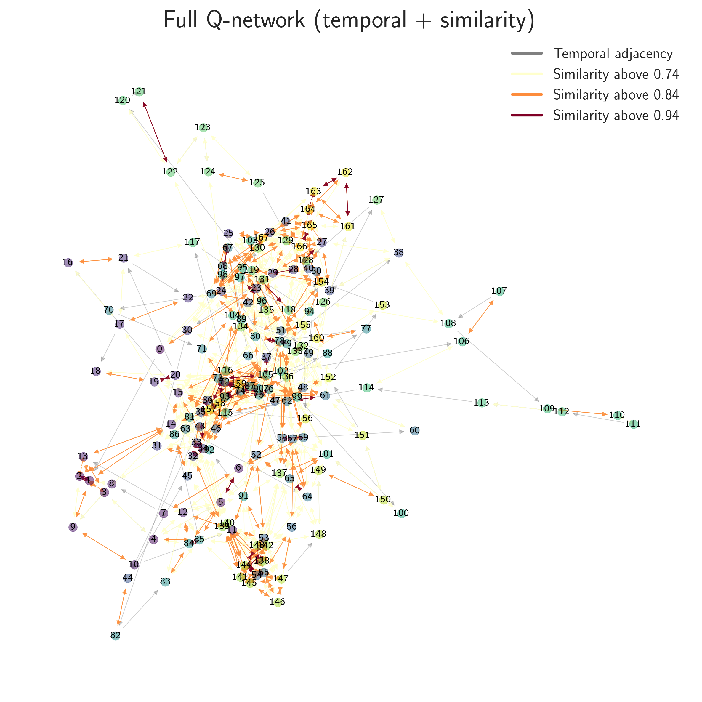



## Project A: Artificial Phenomenology from _Q_-networks

**Summary**: 
Embeds data from brains or computers into maps of potential experiences (“Q-networks”). Use advanced mathematics to study these interface maps and identify ontologies[^1] such as self, time, and embodiment, drawing on Husserlian/Heideggerian themes. Extends naturally to the life sciences, modeling biological interfaces through evolution.

[^1]: Ontologies are understood as formal patterns or organizational schemes that specify how an agent perceives and interacts with the world. 

  

**Type**: Theoretical (Phenomenology, Mathematics)

**Subprojects**:

*	_A1. Philosophical and Mathematical Synthesis_
*	_A2. Q-networks for Life: Self, Time, Embodiment_
* _A3. Spacetime for Action and Evolution_ 

**Most relevant publications from the lab**: [Mathematized Phenomenology](https://doi.org/10.1007/s11097-025-10060-z), [Category Theory in Consciousness Science](https://doi.org/10.1007/s11229-024-04718-5), [Fusions of Consciousness](https://doi.org/10.3390/e25010129), [Spacetime as Error-Correcting Code](http://constructivist.info/12/3/265),	[Perceptual Networks](https://arxiv.org/abs/2009.08101), [Phenomenal Spaces](https://doi.org/10.1016/j.concog.2019.02.002)

**Why it matters?** Anchors our research in philosophical concepts while enabling translation between AI architectures, phenomenological descriptions, and human sciences. Provides formal platforms for simulating and testing the emergence and properties of interfaces.

## Project B: SLP-Tests for AI Consciousness

**Summary**: Transforms questions of artificial consciousness into operational tests ([SLP-tests](https://youtu.be/hsnUr4H0v9U): subjective-linguistic, latent-emergent, phenomenological-structural). Evaluates the richness, coherence, and integrative capacity of emergent interfaces, while also guiding the design of novel interface architectures.

  

**Type**: Empirical (Engineering, Benchmarking)

**Subprojects**:

* _B1. SLP-Tests: Implementation and Validation_
* _B2. Subjective Grammar and Meaning in Language Models_
* _B3. Novel Interface Designs_ 

 
**Most relevant publications from the lab**: [Artificial Consciouisness as Interface Representation](https://doi.org/10.48550/arXiv.2508.04383), [Interfacing Consciousness](https://doi.org/10.3389/fpsyg.2024.1429376), [Mathematized Phenomenology](https://doi.org/10.1007/s11097-025-10060-z)

**Why it matters?** Operationalizes metaphysical and phenomenological criteria in an empirical framework, allowing AI systems to be benchmarked for relational richness. Extends the interface paradigm to semantic and inter-agent domains, offering new experimental artifacts. Iteratively informs Project A.

## Project C: Technohumanities Research

**Summary**:   Explores how interfaces mediate cultural interpretation of texts, images, and rituals. Develops digital tools to simulate historical subjectivities and integrates intercultural perspectives to broaden the scope of interface analysis.

  
  

    Metaphysics of the Machines by <a href="http://www.predragnikolic.com/" target="_blank">P. Nikolić</a>
  

**Type**: Interdisciplinary Bridging Projects (Ethics, Epistemology, Intercultural Studies, Art)

**Subprojects**:

* _C1. AI ethics_
* _C2. Humanities case studies_
* _C3. Interdisciplinary collaborations and outreach_

**Most relevant publications from the lab**: [Daoist Unity of Science](https://doi.org/10.1163/29502799-bja10010), [Epistemoverse](https://doi.org/10.48550/arXiv.2512.12201), FBT-book, [Science of Consciousness Beyond Neuroscience](https://doi.org/10.31234/osf.io/bhj9t_v1), [Artistic Mediation in Mathematized Phenomenology](https://philarchive.org/archive/PREAMI-2), [Dr Goff, Tear Down This Wall!](https://philarchive.org/rec/PREDGT)

**Why it matters?** Strengthens conceptual clarity and philosophical integration while ensuring that technical projects remain aligned with ethical and epistemological concerns. Broadens the scope of interface analysis beyond Western traditions, fostering dialogue across diverse cultural contexts. Anchors the lab’s public-facing and interdisciplinary output, connecting technology, ethics, art, and global humanities into a coherent vision of the technohumanities.
