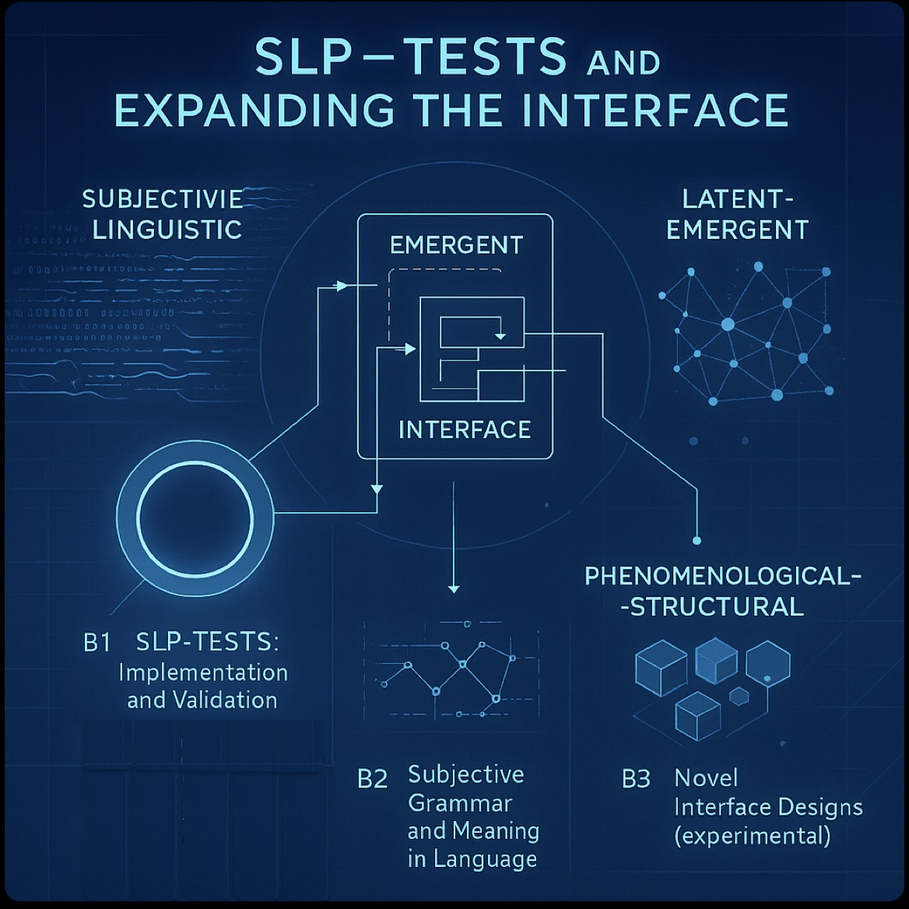



## Project A: Artificial Phenomenology from Agent-Networks

**Summary**: Models the relational substrate (RS) as a network of interacting agents, formalizing their collective dynamics through ontologies[^1] that encode structures of embodiment, spacetime, and selfhood. Implements this agent-based RS model in AI systems, then deploys category theory to bridge it with phenomenological frameworks, incorporating Husserlian/Heideggerian themes.

[^1]: Ontologies are understood as formal patterns or organizational schemes that specify how an agent perceives and interacts with the network. 

**Type**: Theoretical (Phenomenology, Mathematics)

**Subprojects**:

*	_A1. Philosophical and Mathematical Synthesis_
*	_A2. Selves, Embodiment, and World Models_
* _A3. Spacetime from Agent-Networks_ 

**Most relevant publications of the group**: [Mathematized Phenomenology](https://doi.org/10.1007/s11097-025-10060-z), [Category Theory in Consciousness Science](https://doi.org/10.1007/s11229-024-04718-5), [Interfacing Consciousness](https://doi.org/10.3389/fpsyg.2024.1429376), [Fusions of Consciousness](https://doi.org/10.3390/e25010129), [Spacetime as error-correcting code](http://constructivist.info/12/3/265),	[Perceptual Networks](https://arxiv.org/abs/2009.08101), [Phenomenal Spaces](https://doi.org/10.1016/j.concog.2019.02.002)

**Why it matters?** Anchors our research in philosophical concepts, enabling translation between phenomenological descriptions, AI architectures, and philosophy. Provides concrete, formal platforms for simulating and testing the emergence and properties of interfaces.<!--, preparing to bridge metaphysics and computational implementation.-->

<!--
## Project B: Interface Construction from Agent-Networks

**Summary**: Simulate and mathematically model RS as agent-networks whose collective dynamics can be captured by data structures[^1] that resemble embodiments, spacetime, and selves. This informs the design of interfaces by which (artificial and natural) systems could interact with RS. 

**Type**: Theory (Simulation, Network Theory)

**Subprojects**:

* *B1. Selves, Embodiment, and World Models*

* *B2. Spacetime from Agent-Networks* 

**Most relevant publications from the group**: [Interfacing Consciousness](https://doi.org/10.3389/fpsyg.2024.1429376), [Fusions of Consciousness](https://doi.org/10.3390/e25010129), [Spacetime as error-correcting code](http://constructivist.info/12/3/265),	[Perceptual Networks](https://arxiv.org/abs/2009.08101), [Phenomenal Spaces](https://doi.org/10.1016/j.concog.2019.02.002)

**Why it matters?**: Provides concrete, formal platforms for simulating and testing the emergence and properties of interfaces, preparing to bridge metaphysics and computational implementation. Results feed into the other projects’ analyses and operationalization.
-->

## Project B: SLP-Tests and Expanding the Interface

**Summary**: Transforms questions of artificial consciousness into operational tests (SLP-tests: subjective-linguistic, latent-emergent, phenomenological-structural) to evaluate the richness, coherence, and integrative capacity of (emergent) interfaces. Designs novel interfaces. 

  

**Type**: Empirical (Engineering, Benchmarking)

**Subprojects**:

* _B1. SLP-Tests: Implementation and Validation_
* _B2. Subjective Grammar and Meaning in Language Models_
* _B3. Novel Interface Designs_  (experimental)

**Most relevant publications from the group**: [Artificial Consciouisness as Interface Representation](https://doi.org/10.48550/arXiv.2508.04383), [Interfacing Consciousness](https://doi.org/10.3389/fpsyg.2024.1429376), [Mathematized Phenomenology](https://doi.org/10.1007/s11097-025-10060-z)

**Why it matters?** Operationalizes metaphysical and phenomenological criteria in an empirical framework, allowing AI systems to be benchmarked for the structure of their access to RS. Extends our the interface paradigm to semantic and inter-agent domains, offering new experimental artifacts. Iteratively informs projects A and B.

## Project C: Technohumanities

**Summary**:  Connects the computational framework pursued in projects A and B with a broader perspective on the humanities. Facilitates the interpretation, reflection, and critique of all technical models and results in a non-technical context. 

  

**Type**: Interdisciplinary Bridging Projects (Ethics, Epistemology, Art, Digital Humanities)

**Subprojects**:

* _C1. AI ethics_
* _C2. Humanities case studies_
* _C3. Interdisciplinary collaborations and outreach_

**Most relevant publications of the group**: Epistemoverse, FBT-book, [Science of consciousness beyond neuroscience](https://doi.org/10.31234/osf.io/bhj9t_v1), Daoist unity of science, [Artistic Mediation in Mathematized Phenomenology](https://philarchive.org/archive/PREAMI-2), [Dr Goff, Tear Down This Wall!](https://philarchive.org/rec/PREDGT)

**Why it matters?** Provides philosophical clarity and conceptual integration; supports the iterative refinement of (sub-)project goals, and ensures alignment between technology, ethics, and metaphysical vision. Also forms the core of public-facing and interdisciplinary output. 
